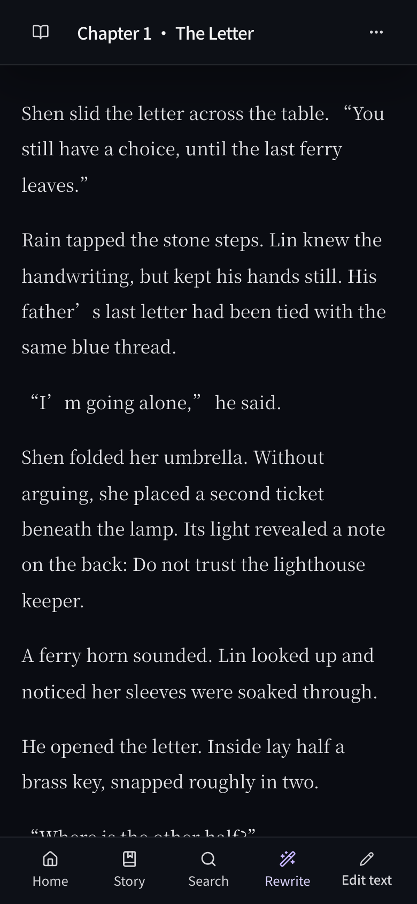
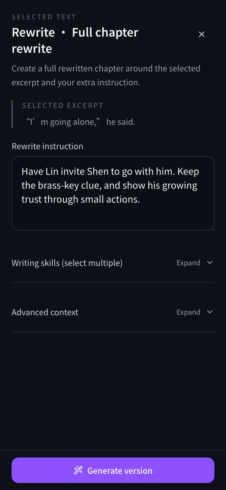
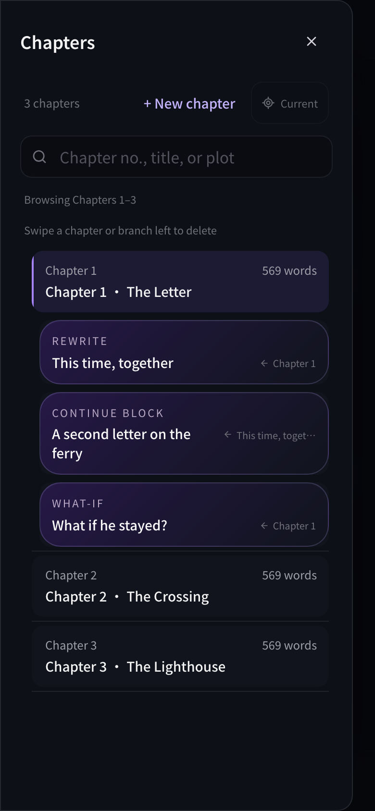
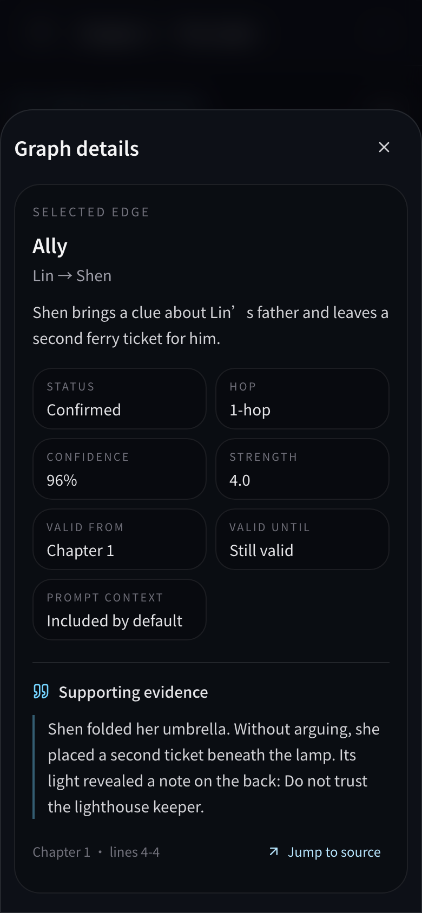

[简体中文](README.md) · **English**

# ReTale

ReTale is a novel reader and creative workspace with an AI writing assistant. Import a book, highlight a moment you want to change, and describe what you would like to happen next.

Rewrite a disappointing turn, continue a story you love, or step into a character’s role for a conversation. Character relationships, world details, and passages from the book can inform your writing, while the original story and your new branches remain separately accessible.

[Explore the features](#what-you-can-do) · [Get started](#get-started) · [Common questions](#common-questions)

## From reading to rewriting, on your phone

**① Read a chapter → ② Select a passage and describe your change → ③ Revisit your story branches in chapter navigation.**

<p align="center">
  
  
  
</p>

*Actual mobile UI screenshots using an original sample story, Letters from the Mist. Story text, branches, and analysis are prepared demo data, not the output of a live AI generation. [About the images and how to recreate them](docs/readme-media.md).*

## What you can do

### Turn “what if…” into another version

Highlight a passage, tap **Rewrite**, and describe your idea in everyday language. ReTale uses that moment as the starting point and the chapter as context to create a new version of the whole chapter.

> “Have Lin invite Shen to go with him. Keep the brass-key clue, and show his growing trust through small actions.”

Keep a result as a continuation block, or create a **What-if branch** to explore what your change means for the story. Generating and saving a branch does not automatically replace the original chapter.

### Keep writing, or jump ahead

Continue from a version you like. Rewrites, continuations, and alternate branches appear in chapter navigation, making them easy to revisit and develop. Regenerated versions also retain revision history.

Curious about a later reunion or turning point? **Future Jump** lets you choose a later chapter, summarizes how events connect your branch point to that destination, and writes a new version of the scene there.

### Step into a character’s role

Select a scene and enter **Roleplay**. Choose who you play and whom you interact with, then offer an opening line or a direction for the scene. AI continues the dialogue, actions, and narration using the story context.

Continue the conversation, regenerate a reply, or explore a different path from an earlier exchange.

### Look up relationships, world details, and their sources

After you build the story’s knowledge base, ReTale can organize characters, relationships, places, world details, outlines, and events. Open **Story context** or **Graph** when you need to recall why two people became allies or what a character knows at this point.

Relationship details can show quoted evidence and link back to the source passage. Before generating, you can also inspect and adjust the reference material in **Advanced context**. You choose the direction, with the supporting story information available to review.

<details>
<summary>See relationship details and source evidence on mobile</summary>

<p align="center">
  
</p>

</details>

### Learn from writing you enjoy

In **Writing skills**, choose books from your library or upload separate TXT reference material. Describe what you want to study: dialogue with subtext, character introductions, or tense chase scenes, for example.

ReTale extracts reusable writing methods, things to avoid, and example passages. Refine the resulting skill cards in everyday language and select them when writing a new scene.

### Find a scene without remembering the exact words

Use **Exact search** for a phrase you remember, or **Semantic search** to describe a scene in your own words, such as “the first time she leaves him a ferry ticket.” Search covers the book text and saved rewrites, with results that open the matching content.

Searching by meaning requires a configured retrieval model and prepared search data for the book. Exact search remains available without them.

## What makes ReTale different

| Design | What it means for you |
| --- | --- |
| **Start where you are reading** | Highlight a passage and begin adapting it without copying chapters into a separate chat. |
| **References tied to the story** | Context is organized around the current chapter and branch to help preserve character motives, relationships, and world rules. |
| **Keep the original and your alternatives** | Try different directions and return to the version you want to continue. |
| **Comfortable on a phone** | The text takes priority, common actions sit at the bottom, and chapters and references open when needed. Choose dark, light, or soft green themes and your reading fonts. |
| **Choose your AI** | Connect an OpenAI-compatible service or local Ollama models. Configure writing, story analysis, and retrieval separately. |
| **Keep your library on your own device** | Books and writing are stored on the computer or server running ReTale. When using an online AI service, the text needed for a request is sent to that provider. |

These features help ground the writing in the book. AI can still miss or misunderstand details, so you decide what to keep.

## Get started

### Already have ReTale open?

1. **Import a book.** Select **Import novel** in the library and choose a TXT file. Automatic chapter splitting currently focuses on Chinese headings such as `第一章` or `第 12 章`.
2. **Connect your AI.** Open **Settings → AI models** and configure the **Writing AI model** and **Knowledge-building AI model**. For an online service, enter the address, API key (access credential), and model name supplied by your provider. You can also connect your own Ollama service.
3. **Try a rewrite.** Open a chapter, press and hold to select text, adjust the selection, then tap **Rewrite** at the bottom. Describe your idea and generate a version.
4. **Save a direction you like.** Keep it as a continuation block or create a What-if branch, then return through chapter navigation.
5. **Add richer references.** Open **More options → Knowledge status** to build the knowledge base. For searching by meaning, add an **Embedding model**—a model used to find text with related meanings—and prepare the book’s retrieval data.

You can read and try rewriting before the whole book has been analyzed. More complete story references and search data give the writing assistant more material to work with.

### First installation

ReTale currently runs on your own computer or server and opens in a browser. Installation uses a terminal; everyday reading and writing happen in the web interface.

Install [Node.js](https://nodejs.org/) **22.15.0 or newer** and [Python 3](https://www.python.org/downloads/) for story analysis (3.11–3.13 recommended). Download and extract this project, open a terminal in its folder, and run:

```bash
npm install
npm run dev:prod
```

Installation automatically prepares the Python environment for story analysis. The first setup needs an internet connection and may take a while. Once the server starts, open **[http://localhost:14500](http://localhost:14500)** on that computer. Keep the terminal running, then import a book and configure AI as described above.

To use your phone on the same trusted network, open `http://YOUR-COMPUTER-LAN-IP:14500` in its browser. The computer must stay on and its firewall must allow the connection. ReTale is a personal, single-user application without login protection; do not expose it directly to the public internet.

For detailed configuration, production deployment, backups, and development commands, see [Development and operations](docs/development.md).

## Common questions

**Can I use it without AI?** Yes: import, read, edit manually, and search for exact phrases. Rewriting, roleplay, story analysis, and writing-skill extraction need the corresponding AI service. Semantic search also needs a retrieval model and prepared search data.

**Do I need a paid AI service?** No. You can connect local models through Ollama. Online providers set their own prices; local models require suitable hardware.

**Does it support English?** The interface supports Chinese and English. TXT chapter detection and the built-in story-analysis workflow currently favor Chinese novels; an English interface does not imply equal processing quality for English books.

**Where is my writing stored?** In the `data/` folder on the device running ReTale by default. Your phone accesses that library; it does not store a separate copy. Reading positions and similar preferences are kept in each browser and do not automatically sync between devices. See the [backup instructions](docs/development.md#backups).

**Can I use SillyTavern presets?** ReTale can import compatible presets and regex rules, but not every field takes effect. See [Preset compatibility](docs/preset-compatibility.md) for the supported scope.

---

[简体中文](README.md) · [Development and operations](docs/development.md) · [Knowledge graph design](docs/knowledge-graph-design.md) · [Demo images](docs/readme-media.md)
