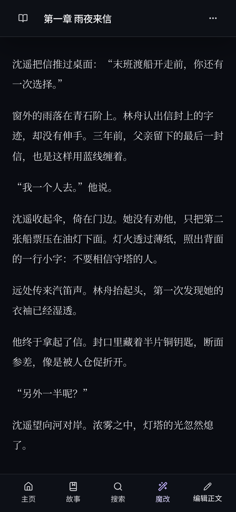
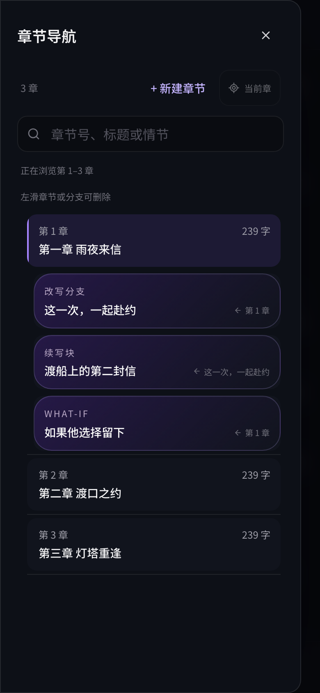
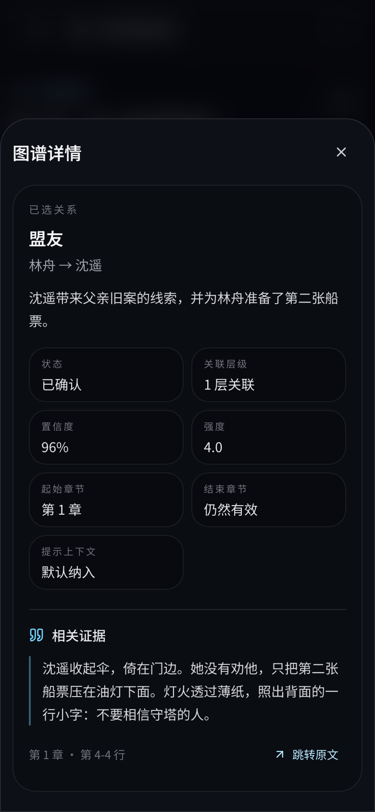

**简体中文** · [English](README.en.md)

# ReTale · 戏说

**戏说不是胡说，改编不是乱编**

ReTale 是一个带 AI 创作助手的小说阅读与改编工作台。导入一本小说，读到想改变的情节时，选中一段文字，说出你的想法，就能探索故事的另一种可能。

你可以改写遗憾的转折、接着喜欢的故事往下写，也可以扮演书中人物，亲自参与一段对话。人物关系、世界设定和原文线索都能成为创作的参考，原来的故事与新写出的分支也能分别保留。

[看看能做什么](#能做什么) · [开始使用](#开始使用) · [常见问题](#常见问题)

## 手机上，从阅读到改写

**① 阅读小说 → ② 选中文字，写下改编想法 → ③ 在章节导航中找回不同分支。**

<p align="center">
  
  
  
</p>

*以上为实际移动端界面截图，使用原创示例故事《雾城来信》。故事、分支与分析资料为预先编写的演示数据，不代表一次真实 AI 生成的结果。[素材说明与重新截图方法](docs/readme-media.md)。*

## 能做什么

### 把“如果当时……”写成另一个版本

在正文中选中让你在意的片段，点击「魔改」，用日常语言描述你想改变什么。ReTale 会以这段情节为切入点，结合章节内容，生成一个新的整章版本。

> “让林舟决定和沈遥一起赴约。保留铜钥匙的伏笔，用动作表现他从戒备到信任的转变。”

满意后，可以把结果「保存为续写块」，也可以「创建 What-if 分支」，探索这个假设会带来哪些变化。生成和保存分支不会自动覆盖原文章节。

### 顺着新故事继续写，也能直接看看未来

喜欢某个版本，就从那里继续写。改写、续写和假设分支会出现在章节导航里，方便返回、比较和继续创作；重新生成的内容也有版本历史可查。

如果你更关心后面的某场重逢或结局，可以使用「跳到未来」（Future Jump），选择后面的目标章节。ReTale 会先整理从分歧点到目标章节之间发生了什么，再生成那个时刻的新版本。

### 走进故事，和角色对话

选中一个场景，进入「角色扮演」，选择你扮演的人物和互动对象。你可以给出一句开场白，或说明希望剧情往哪里发展，让 AI 接着写双方的对话与动作。

对话可以继续、重新生成，也可以从某一轮走向不同分支。想体验“如果这句话由我来说”，就从这里开始。

### 随手查人物、设定和原文依据

建立故事知识库后，ReTale 可以整理人物、关系、地点、世界设定、大纲和事件。阅读时忘记“他们为什么结盟”，或写作时拿不准“这个角色此时知道什么”，都可以打开「故事上下文」或「图谱」查阅。

关系详情可以显示引用的原文，并支持跳回来源。生成前还可以在「高级上下文」里检查、调整本次提供给 AI 的参考内容。这样，改编方向由你决定，故事依据也能看得见。

<details>
<summary>查看移动端的关系详情与原文依据</summary>

<p align="center">
  
</p>

</details>

### 把喜欢的写法，整理成自己的写作技巧卡

在「写作技巧」中选择书库里的作品，或上传仅用于学习的 TXT 素材，告诉 AI 你想研究什么，例如“有潜台词的对话”“人物出场”或“紧张的追逐场面”。

ReTale 会提炼写作方法、避免事项和参考范文。你可以继续用自然语言调整技巧卡，并在创作时选用，让好的写法成为可反复使用的参考。

### 忘记原句，也能找回情节

搜索支持两种方式：记得原话时，按词句精确搜索；只记得情节时，用一句描述按含义查找，例如“她第一次把船票留给他”。搜索涵盖正文和已保存的改写内容，点击结果可以打开对应位置。

按含义搜索需要先配置检索模型并准备本书的检索数据；没有准备好时，仍可使用精确搜索。

## 为什么这样设计

| 设计 | 对你有什么用 |
| --- | --- |
| **阅读就是创作入口** | 不用来回复制正文到聊天窗口，读到哪里，就从哪里开始改编。 |
| **故事资料跟着章节走** | 创作参考围绕当前章节和分支组织，帮助 AI 延续人物动机、关系和设定。 |
| **原作与分支分开保留** | 可以放心试写多种走向，再回到想继续的版本。 |
| **手机上也能舒服地读和写** | 正文优先，常用操作放在底部，章节和资料按需展开；提供深色、浅色、护眼绿主题及阅读字体选择。 |
| **模型由你选择** | 支持兼容 OpenAI 接口的 AI 服务和 Ollama 本地模型，写作、故事分析与检索可以分别配置。 |
| **书库保存在自己的设备上** | 小说和创作内容存储在运行 ReTale 的电脑或服务器上；使用在线 AI 时，本次请求所需的文本会发送给你选择的服务。 |

这些设计帮助创作更贴合原著，但 AI 仍可能误读或遗漏细节，最终内容由你审阅取舍。

## 开始使用

### 已经能打开 ReTale？从这里开始

1. **导入一本书。** 在书库点击「导入小说」，选择 TXT 文件。自动分章目前主要识别「第一章」「第 12 章」这类中文标题。
2. **连接 AI。** 打开「设置 → AI 模型」，配置「写作 AI 模型」和「知识库构建 AI 模型」。使用在线服务时，填写服务商提供的地址、API Key（访问密钥）和模型名；也可以连接自己运行的 Ollama。
3. **先试一次改写。** 打开章节，长按正文选中文字，拖动两端调整范围，再点底部「魔改」，写下你的想法并生成版本。
4. **保存喜欢的走向。** 将结果保存为续写块或创建假设分支，之后从章节导航继续。
5. **再补全故事参考。** 从「更多选项 → 知识状态」构建知识库。想按含义搜索原文，再添加 Embedding 模型（用于理解文本含义的检索模型），准备内容检索。

不必等全书分析完才开始阅读或尝试改写。故事资料和检索数据越完整，可供创作参考的内容也越充分。

### 第一次安装

ReTale 目前需要在自己的电脑或服务器上安装，再用浏览器访问；它不是下载后直接打开的手机 App。安装需要使用终端，日常阅读与创作都在网页里完成。

准备好 [Node.js](https://nodejs.org/) **22.15.0 或更新版本**和 [Python 3](https://www.python.org/downloads/)（故事分析会用到，建议 3.11–3.13），下载本项目并解压，在项目文件夹中打开终端，依次运行：

```bash
npm install
npm run dev:prod
```

安装时会自动准备故事分析所需的 Python 环境，首次安装需要联网，可能花费一些时间。启动后，在这台电脑的浏览器里打开 **[http://localhost:14500](http://localhost:14500)**。保持终端运行，即可按上面的步骤导入小说并设置 AI。

手机与这台电脑处于同一可信网络时，可在手机浏览器访问 `http://电脑的局域网IP:14500`；电脑需要保持开机，防火墙也需要允许连接。当前是个人使用的单用户应用，没有登录保护，不应直接暴露到公网。

详细配置、正式部署、数据备份和开发命令见[安装与维护参考（英文）](docs/development.md)。

## 常见问题

**不接 AI 能用吗？** 可以导入、阅读、手动编辑和精确搜索。改写、角色互动、故事分析和技巧提炼需要相应的 AI 服务；语义搜索另需检索模型和已准备好的检索数据。

**一定要付费 AI 吗？** 不一定，可以连接 Ollama 本地模型。在线服务是否收费、如何计费由服务商决定；本地运行模型需要相应的设备性能。

**支持英文吗？** 界面可切换中文和英文。TXT 自动分章和内置故事分析流程目前更偏向中文小说；英文界面不代表英文小说的处理效果与中文完全相同。

**内容存在哪里？** 默认存放在运行 ReTale 的设备上的 `data/` 文件夹中。手机只是访问这份书库，不是把书库存到手机里。阅读位置等偏好保存在当前浏览器；跨设备不会自动同步这些偏好。备份方式见[备份说明](docs/development.md#backups)。

**已有 SillyTavern 预设可以用吗？** 可以导入兼容的预设和正则规则，但并非所有字段都会生效。具体范围见[预设兼容说明](docs/preset-compatibility.md)。

---

[English](README.en.md) · [安装与维护](docs/development.md) · [故事知识库设计](docs/knowledge-graph-design.md) · [演示素材](docs/readme-media.md)
